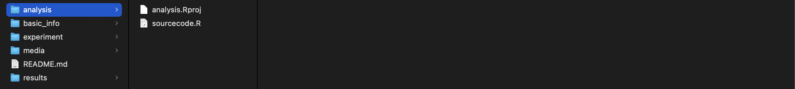

# Bats integrate multiple echolocation and flight tactics to track prey  
Journal: Current Biology  
Authors: Nozomi Nishiumi, Emyo Fujioka, Shizuko Hiryu

- - -

　　 
## Composition:
`"analysis" folder` contains the R project file and R script file that generate all figures, supplemental data in the paper.

---

`"experiment" folder` contains raw data of bat–moth positions and pulse directions, as well as images and 3D-interactive HTML files describing the situation of each session.

_Location of images describing each session_

　

_3D-interactive image of (Left) bat-moth flight trajectories, (Right) target and pulse directions from the bat's viewpoint._

---

`"results" folder` contains figures and supplemental data used in the paper.

---

`"basic_info" folder` contains the ID, sex, body weight of bats, and experiment dates for each session.

　　 
## Note:
The R script file “sourcecode.R” generates figures and supplemental data to the “results” folder, and and additional data for each session to "experiments" folder by referring to raw data in the “experiments” and “basic_info” folders. Thus, it is necessary to maintain the file and folder structure of this dataset.
The R project file “analysis.Rproj” defines the initial file path to correctly refer to those folders. Thus, you should first activate “analysis.Rproj” and then open “sourcecode.R”. This R project file works based on the free IDE “RStudio”. 

　　 
## Procedure to run the R script:
This R project file works based on a free IDE "R studio".
Here is the procedure to run the R script.

1. Install "R" and its IDE “RStudio” from https://posit.co/download/rstudio-desktop/.
2. `git clone https://github.com/Nozomi-Nishiumi/target_tracking_strategy_in_bats.git` or Download zip file from this repository.
3. Open the project file “analysis.Rproj” in the “analysis” folder using RStudio.
4. Open the R script “sourcecode.R” in the “analysis” folder using RStudio.
5. Run the script (push the "Source" command in RStudio's user interface).

　　 
## Description of sourcecode.R:
**[Lines 5–23](https://github.com/Nozomi-Nishiumi/target_tracking_strategy_in_bats/blob/05b35ea9473366e3008273ce1d35385df2948216/analysis/sourcecode.R#L5)**: 
List of packages

**[Lines 39–3773](https://github.com/Nozomi-Nishiumi/target_tracking_strategy_in_bats/blob/05b35ea9473366e3008273ce1d35385df2948216/analysis/sourcecode.R#L39)**: 
Definitions of functions

**[Lines 3808–3811](https://github.com/Nozomi-Nishiumi/target_tracking_strategy_in_bats/blob/05b35ea9473366e3008273ce1d35385df2948216/analysis/sourcecode.R#L3808)**: 
There is a controller for generating the results.
- If `generate_results` is T, the program regenerates all results in the "results" directory.
- If `draw_EachSession` is T, the program regenerates images describing the situation of each session, which will be saved in each session folder in the “experiments” folder.
- If `draw_RGLfigures` is T, the program generates 3D interactive HTML images and saves them in each session folder in the “experiments” folder. These 3D interactive HTML images should be opened by your web browser that supports JavaScript, and then you can control the viewpoint of the image by dragging your mouse.
- If `generate_results_delay` is T, the program regenerates all results related to Figs. 2F and S3C. Because this process consists of many iterations, it can take some time.

**[Lines 3813–3825](https://github.com/Nozomi-Nishiumi/target_tracking_strategy_in_bats/blob/05b35ea9473366e3008273ce1d35385df2948216/analysis/sourcecode.R#L3813)**:
Basic parameters

**[Lines 3828 and later](https://github.com/Nozomi-Nishiumi/target_tracking_strategy_in_bats/blob/05b35ea9473366e3008273ce1d35385df2948216/analysis/sourcecode.R#L3828)**:
Main processing section

　　 
## Contact Information
- Dr. Nozomi Nishiumi  
  Email: nozo@nibb.ac.jp, n.oz.o@hotmail.co.jp
